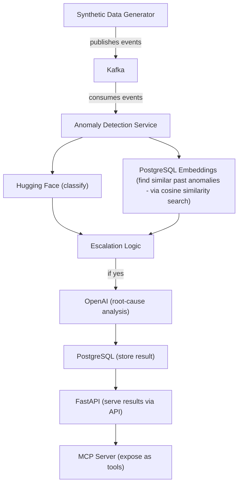

# Interface Health Monitor

Real-time **AI-powered incident intelligence and root cause analysis system** for integration pipelines.

---

## Overview

This system ingests real-time integration error events (Datadog-style payloads), santizes the payloads of any pii data, processes them through a streaming kafka pipeline, and uses embeddings + LLM reasoning to:
- Detect similar failures across agencies
- Analyze patterns over time
- Infer likely root causes
- Suggest actionable troubleshooting steps

---
## Architectural Diagram

This system ingests synthetic network events, detects anomalies, enriches them with semantic search, and selectively escalates for LLM-based root cause analysis.

---

## Key Features

### Real-Time Streaming
- Kafka-based event ingestion and processing

### AI-Driven Similarity Search
- Embeddings used to detect similar failure patterns across different agencies

### Temporal Pattern Detection
- Identifies recurring failures (e.g. batch errors, periodic outages, config drift)

### Context-Aware Root Cause Analysis
- Combines:
  - Current error
  - Similar past events
  - Recent agency history
- Generates actionable explanations using LLM

### Safe Log Processing
- Sensitive fields stripped before AI processing

---

## Example Capabilities

- Detect recurring monthly failures → infer credential or certificate expiration
- Identify batch failures → suggest payload/data issues
- Correlate prior outages → infer misconfiguration after system rebuild
- Provide targeted troubleshooting steps before escalation

---

## Tech Stack

- **Streaming:** Kafka
- **Backend:** Python
- **Database:** PostgreSQL
- **Embeddings:** sentence-transformers
- **AI Reasoning:** LLM (OpenAI-compatible)

---

## Run this project (in the project terminal)

### Start infrastructure
docker compose up -d

### Start consumer
python3 -m src.streaming.consumer

### Ingest real events
POST /ingest/error-log
- Use test payloads found in "test_payloads" directory of this folder

## Future Improvements

Replace similarity layer with pgvector or Pinecone for scalable vector search
Add confidence scoring to root cause analysis
Detect additional patterns (gradual degradation, anomaly drift)
Build UI dashboard for incident visualization

## Design Notes

Embeddings currently stored in PostgreSQL for simplicity
System designed to support pluggable vector databases (e.g., Pinecone) for production scalability
Emphasis on interpretable AI reasoning, not just anomaly detection

## Why This Project
Modern monitoring tools surface alerts — but not explanations.
This system focuses on:

turning raw failure signals into actionable insight through context + AI reasoning